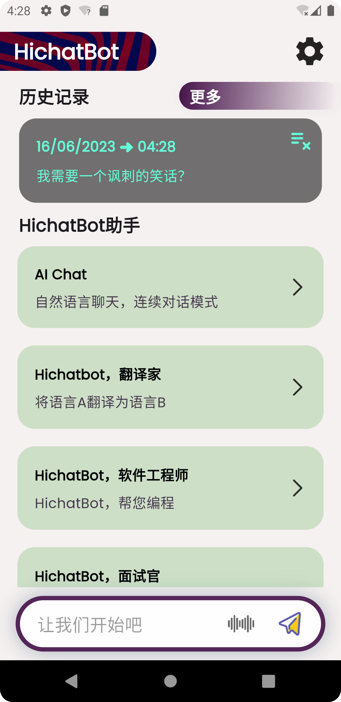
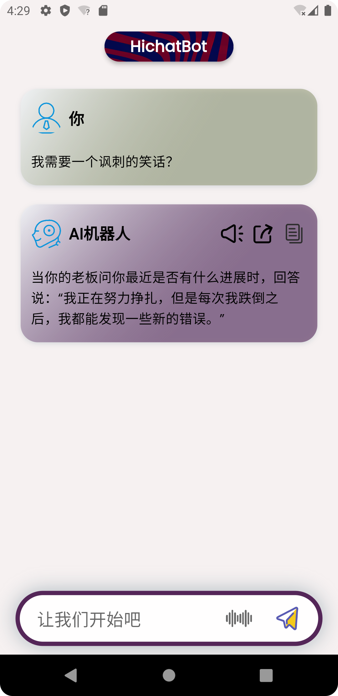
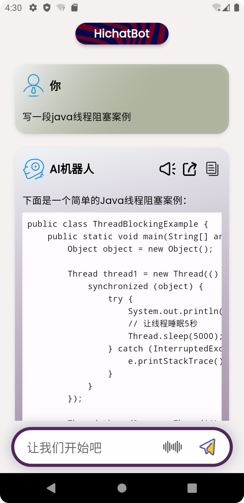
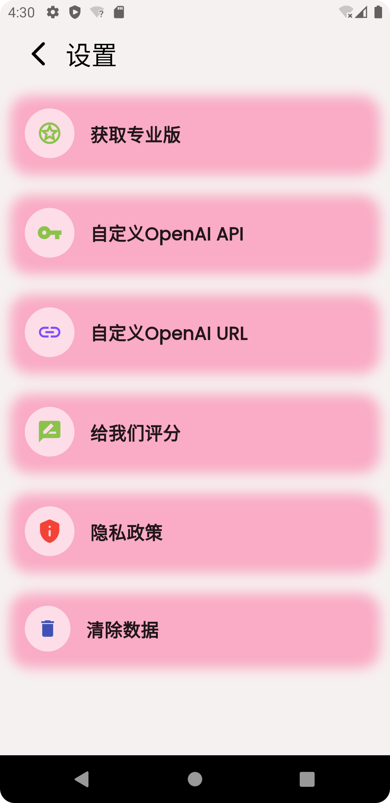

# HichatBot简介

HiChatBot产品说明：您全能的人工智能助手

**HiChatBot**是一款跨平台应用，采用强大的OpenAI API开发而成，为您提供流畅智能的对话体验。HiChatBot非常注重用户隐私，绝不在线储存您的聊天记录，让您安心掌握个人信息。

# HichatBot详细介绍(吹嘘版)
1. 随意闲聊：HiChatBot是您友好的伴侣，随时为您提供聊天。无论您想找人聊天、分享想法或讨论各种话题，HiChatBot都愿意与您互动，为您带来愉快的交流体验。

2. 智能回答：HiChatBot采用先进的人工智能算法，能够智能分析和理解您的查询，提供准确有意义的回答。通过持续学习能力，该机器人适应您的对话风格，使每次互动更加个性化和自然。

3. AI翻译：HiChatBot的AI翻译功能让沟通无国界。无论是简单短语还是复杂句子，HiChatBot都能提供各种语言的实时翻译。借助HiChatBot，您可以轻松打破语言障碍，畅游世界，实现跨文化的无缝交流。

4. 代码助手：需要编码帮助吗？不用再找了。HiChatBot内置了代码助手，可帮助您编写代码片段、解决错误并提供有益建议。无论您是初学者还是经验丰富的程序员，HiChatBot都是您进行编码相关查询的首选伴侣。

5. 学习支持：HiChatBot是一位多才多艺的学习伴侣，可在各种学科中帮助您。无论是数学、历史、科学还是文学，HiChatBot的广泛知识库都能为您提供见解、解释和问题答案，帮助您扩展理解力并在学业中取得卓越成绩。

HiChatBot提供用户友好且直观的界面，易于导航和访问所有功能。无论您是学生、职业人士还是只是好奇，HiChatBot都将陪伴您踏上旅程。

拥有HiChatBot，您的可能性将无限延伸。赋予自己一位智能助手，提升工作效率、丰富知识、促进无缝沟通。立即下载HiChatBot，体验触手可及的下一代人工智能助手。

# 截图

# 使用说明
## 如果您想体验chatGPT的功能，可以直接下载我们的编译版本

## 如果您自有openai账号，下载我们的编译版本，可以自定义key和中转url

## 如果您有编程技能欢迎clone、修改、发布，别忘了给我们star
