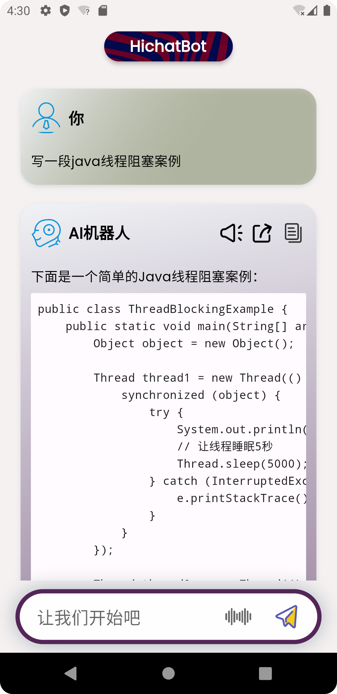

# Introduction to HiChatBot

HiChatBot Product Description: Your all-in-one AI assistant

**HiChatBot** is a cross-platform application developed using the powerful OpenAI API, providing you with a smooth and intelligent conversational experience. HiChatBot places great emphasis on user privacy and never stores your chat logs online, ensuring that you have full control over your personal information.

# Detailed Description of HiChatBot (Puffery Version)
1. Casual Chats: HiChatBot is your friendly companion, ready to chat with you anytime. Whether you want someone to talk to, share ideas, or discuss various topics, HiChatBot is willing to interact with you and provide an enjoyable communication experience.

2. Intelligent Responses: HiChatBot employs advanced AI algorithms to intelligently analyze and understand your queries, providing accurate and meaningful answers. Through its continuous learning capabilities, this bot adapts to your conversational style, making each interaction more personalized and natural.

3. AI Translation: HiChatBot's AI translation feature breaks down language barriers. Whether it's a simple phrase or a complex sentence, HiChatBot offers real-time translation in various languages. With HiChatBot, you can effortlessly overcome language barriers, explore the world, and achieve seamless cross-cultural communication.

4. Code Assistant: Need coding help? Look no further. HiChatBot comes equipped with a code assistant to help you with code snippets, error resolution, and provide valuable suggestions. Whether you're a beginner or an experienced programmer, HiChatBot is your go-to companion for coding-related queries.

5. Learning Support: HiChatBot is a versatile learning companion that can assist you in various subjects. Whether it's math, history, science, or literature, HiChatBot's extensive knowledge base offers insights, explanations, and answers to help you expand your understanding and achieve excellent academic results.

HiChatBot offers a user-friendly and intuitive interface, making it easy to navigate and access all its features. Whether you're a student, a professional, or just curious, HiChatBot will accompany you on your journey.

With HiChatBot, your possibilities are limitless. Empower yourself with an intelligent assistant to boost productivity, enrich knowledge, and facilitate seamless communication. Download HiChatBot now and experience the next-generation AI assistant at your fingertips.

# Screenshots

# Usage Instructions

## If you want to experience the functionality of chatGPT, you can directly download our compiled version.

[app-release](https://github.com/shipinbaoku/hichatbot/releases/download/v5.0.0/app-release.apk)

[googleplay](https://play.google.com/store/apps/details?id=app.hichatbot.hichatbot)

## If you have your own OpenAI account, downloading our compiled version allows you to customize your API key and intermediary URL.

## If you have programming skills, feel free to clone, modify, and distribute. Don't forget to give us a star!